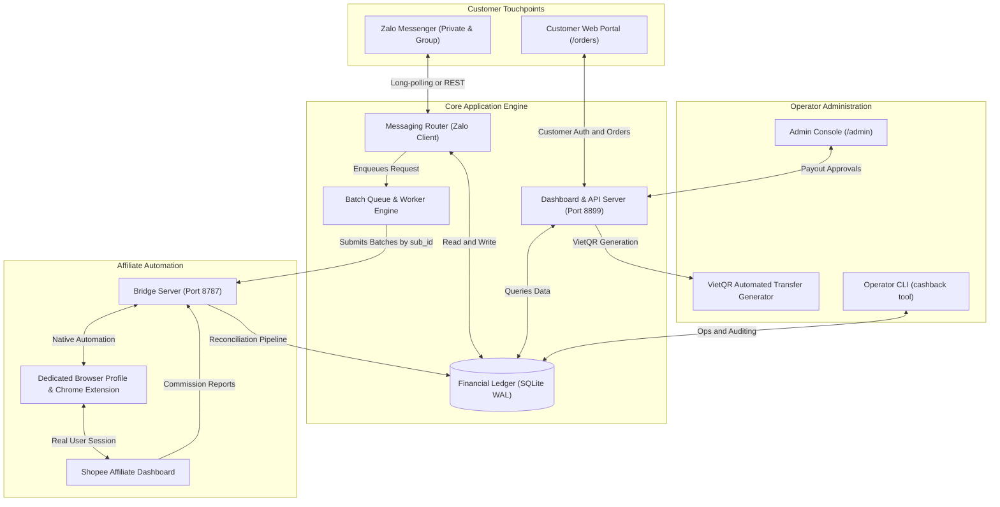

# Shopee Affiliate Cashback & Reconciliation Platform

[](https://www.python.org/)
[](https://github.com/astral-sh/uv)
[](https://react.dev/)
[](https://docs.pytest.org/)
[](LICENSE)

An enterprise-grade, automated Shopee Affiliate link generation, customer ledger, order reconciliation, and cashback management system. 

Built with an asynchronous Zalo messaging bot, a dedicated headless browser bridge for resilient affiliate link generation, an idempotent financial ledger, and an integrated full-stack customer tracking portal with VietQR automated payouts.

---

## 📑 Table of Contents

- [Architecture & Overview](#-architecture--overview)
- [Key Engineering & Financial Invariants](#-key-engineering--financial-invariants)
- [Technology Stack](#-technology-stack)
- [Repository Structure](#-repository-structure)
- [Prerequisites](#-prerequisites)
- [Installation & Setup](#-installation--setup)
- [Running the Services](#-running-the-services)
- [Command Line Interface (CLI)](#-command-line-interface-cli)
- [Web Console & API Routing](#-web-console--api-routing)
- [Security & Access Control](#-security--access-control)
- [Testing & Quality Assurance](#-testing--quality-assurance)

---

## 🏛 Architecture & Overview



The system is decoupled into discrete, fault-tolerant components:
- **`messaging`**: Handles real-time customer dialogues via the official Zalo Bot API, customer consent, identification, and outbound notifications.
- **`worker`**: Aggregates link conversion requests across batched sliding windows to minimize Shopee rate limiting and anti-bot triggering.
- **`shopee`**: Controls an isolated browser profile via a dedicated extension bridge (`browser_bridge.py`), bypassing GraphQL signature verification (`af-ac-enc-dat`, `x-sap-sec`) that blocks standard headless scrapers.
- **`ledger`**: Encapsulates double-entry ledger semantics, customer balances, order lifecycles, and audit logging.
- **`web`**: Serves pre-compiled React 19 SPA static assets and high-performance REST endpoints for customer lookup and operator payout workflows.

---

## 🛡 Key Engineering & Financial Invariants

The platform enforces three non-negotiable financial rules in code (`core/policy.py`, `ledger/repository.py`):

1. **Approved Commissions Only:** Cashback is calculated strictly against *approved* commission amounts from official Shopee conversion reports, never against preliminary estimates.
2. **Idempotent Payout Execution:** Orders marked with `paid_at` cannot be reprocessed or duplicated. Reconciliation pipelines safely overlap reporting periods without double-crediting.
3. **Protected Customer Balances:** Customers with unpaid approved balances cannot be erased or purged (`forget_customer()`) unless explicitly forced by an operator.
4. **Commission Cap Compliance:** Adheres strictly to Shopee's VND 40,000 cap per order for direct Shopee commissions, while correctly processing uncapped seller-bonus (XTRA) commissions:
   $$\text{Total Commission} = \min(\text{Price} \times \text{Rate}_{\text{Shopee}}, 40{,}000) + (\text{Price} \times \text{Rate}_{\text{Seller}})$$
5. **Round-Half-Up Financial Rounding:** Employs precise half-up rounding (`round_dong()`) rather than Python's default round-to-even (Banker's rounding) to guarantee parity with financial institutions.
6. **Transparent Net 80/20 Commission Split:** Computes customer cashback as 80% of net commission received after Shopee's 10% withholding tax ($\text{Cashback} = \text{Gross} \times 90\% \times 80\% = 72\%$), displaying clean and unambiguous net figures across web and chat channels.

---

## 💻 Technology Stack

### Backend & Core
- **Runtime:** Python 3.11+
- **Environment & Dependency Manager:** Astral [`uv`](https://github.com/astral-sh/uv)
- **Database:** SQLite 3 with Write-Ahead Logging (WAL) mode
- **HTTP Engine:** `httpx` (async/sync HTTP client) & Python `ThreadingHTTPServer`
- **Testing:** `pytest` (comprehensive unit & integration suite)

### Frontend & Web Console
- **Framework:** React 19 (TypeScript)
- **Build Tooling:** Vite 6 with `@tailwindcss/vite`
- **Styling:** TailwindCSS v4 with custom design tokens
- **UI Components:** Radix UI primitives & Lucide Icons
- **State & Server Cache:** TanStack React Query v5

### Infrastructure & Reverse Proxy
- **Gateway:** Nginx (Alpine) containerized via Docker Compose
- **Secure Tunneling:** Cloudflare Tunnel (`cloudflared`) for zero-trust public HTTPS deployment
- **Browser Automation:** Chromium / Microsoft Edge with persistent `.browser-profile/`

---

## 📂 Repository Structure

```
.
├── docker-compose.nginx.yml       # Production Nginx reverse proxy configuration
├── pyproject.toml                 # Python project definition and dependencies
├── uv.lock                        # Deterministic dependency lockfile
├── extension/                     # Chrome/Edge extension driving Shopee automation
│   ├── background/                # Background worker scripts and bridge client
│   └── manifest.json              # Manifest V3 extension configuration
├── nginx/
│   └── nginx.conf                 # Nginx gateway configuration and security rules
├── resources/
│   ├── dashboard.vi.json          # Localized strings for the web console
│   └── messages.vi.json           # Outbound customer messaging templates
├── scripts/
│   └── start-browser.ps1          # Dedicated browser profile initiator script
├── src/cashback/                  # Application core packages
│   ├── cli/                       # Operator CLI commands and dispatcher
│   ├── core/                      # Configuration, logging, policy, and math
│   ├── ledger/                    # SQLite repository, schema, and payout calculations
│   ├── messaging/                 # Zalo bot client, templates, and conversation engine
│   ├── shopee/                    # Browser bridge, report parser, and reconciliation
│   ├── web/                       # Embedded HTTP server and API endpoints
│   └── worker/                    # Batch request scheduler and queues
├── tests/                         # Unit and integration test suites (330+ tests)
└── web/                           # React 19 frontend source code
    ├── src/                       # TypeScript components, features, and hooks
    ├── package.json               # Node.js project manifest
    └── vite.config.ts             # Vite build & proxy configuration
```

---

## 🚀 Installation & Setup

### 1. Clone & Environment Sync
Clone the repository and synchronize the virtual environment using `uv`:

```bash
git clone https://github.com/Duke0503/shopee-aff.git
cd shopee-aff

# Install dependencies into .venv
uv sync
```

### 2. Configure Environment Variables
Copy `.env.example` to `.env` and provide your credentials:

```bash
cp .env.example .env
```

Key environment configurations:
- `ZALO_BOT_TOKEN`: Token obtained from `@ZaloBotManager` on Zalo.
- `BRIDGE_TOKEN`: Shared secret connecting the bot to the local browser extension.
- `BRIDGE_PORT`: Local port for extension communication (default: `8787`).
- `DASHBOARD_PORT`: Web UI listening port (default: `8899`).

Generate secure bridge tokens:
```bash
uv run cashback setup-token
```

### 3. Initialize Ledger Database
Initialize the SQLite schema:

```bash
uv run cashback init
```

---

## ⚙ Running the Services

### Step 1: Launch the Dedicated Shopee Browser
The system operates through an isolated browser profile (`.browser-profile/`) to decouple automation from daily personal browsing:

```powershell
powershell -ExecutionPolicy Bypass -File scripts/start-browser.ps1
```
*Note: On first run, log into Shopee Affiliate (`https://affiliate.shopee.vn`). The session cookies persist indefinitely.*

### Step 2: Start the Central Bot Server
Start the central daemon (handles Zalo polling, link worker, reconciliation, and web server):

```bash
uv run cashback serve
```

For persistent background execution on Windows:
```powershell
$env:PYTHONUNBUFFERED="1"; $env:PYTHONIOENCODING="utf-8"
Start-Process uv -ArgumentList "run","cashback","serve" `
  -RedirectStandardOutput logs/console.log `
  -RedirectStandardError logs/console.err.log -WindowStyle Hidden
```

### Step 3: Run the Reverse Proxy (Optional / Recommended)
Start the high-performance Nginx gateway:

```bash
docker compose -f docker-compose.nginx.yml up -d
```

### Step 4: Expose to Public Internet via Cloudflare Tunnel
To make the customer portal available to mobile users (4G/Wi-Fi):

```powershell
cloudflared tunnel --url http://localhost:80
```

---

## ⌨ Command Line Interface (CLI)

The `cashback` CLI provides enterprise administration tools:

| Command | Description |
|---|---|
| `cashback serve` | Runs the full daemon: Zalo bot, link worker, reconciliation & dashboard |
| `cashback status` | Inspects system mode, tax policy, and environment health |
| `cashback payouts` | Displays summary of pending payouts grouped by recipient |
| `cashback payouts --qr` | Generates `payouts.html` with scannable VietQR codes |
| `cashback pay <order-id>` | Confirms payment and updates order state to `paid` |
| `cashback reconcile --live` | Triggers an immediate Shopee conversion report reconciliation |
| `cashback metrics` | Displays key financial indicators (conversion rate, margins) |
| `cashback audit --scan` | Performs automated anomaly detection on customer accounts |
| `cashback audit --customer <id>` | Dumps full transaction and request audit trail for a customer |
| `cashback forget <id>` | Securely erases a customer record (rejects if debt exists) |

---

## 🌐 Web Console & API Routing

The integrated web server (`http://127.0.0.1:8899`) exposes both customer-facing and operator-only interfaces:

### Web Pages
- `/`: Public landing page explaining cashback terms, worked monetary examples, and rules.
- `/login`: Secure customer sign-in with Zalo-issued credentials.
- `/orders`: Authenticated customer order tracker with real-time lifecycle progression (`recorded` → `approved` → `transferred`).
- `/admin`: Operator payout dashboard with one-click VietQR settlement.

### REST Endpoints
- `GET /api/site`: Public policy metrics (cashback rates, estimated payout windows).
- `GET /api/labels`: Dynamic localization dictionary.
- `GET /api/me`: Authenticated customer profile and order ledger.
- `POST /api/auth/login`: Customer authentication.
- `POST /api/auth/logout`: Session termination.
- `GET /api/payouts`: **[Operator Only]** Full payout ledger snapshot.
- `POST /api/customers/<id>/paid`: **[Operator Only]** Marks customer orders as disbursed.

---

## 🔒 Security & Access Control

- **Loopback Enforcement:** Sensitive operational routes (`/admin`, `/api/payouts`, `/api/customers/*/paid`) strictly validate remote address provenance and reject any non-loopback connections (`403 Forbidden`).
- **Data Minimization:** Customer banking details are encrypted and scrubbed from public endpoints; only masked account tails are displayed.
- **Session Protection:** Auth tokens utilize `HttpOnly` and `SameSite=Strict` flags.
- **Bot Token Isolation:** All secrets (`.env`, `base_url.js`, browser cookies) are strictly ignored by version control.

---

## 🧪 Testing & Quality Assurance

The codebase maintains strict automated test coverage across business policies, API shapes, edge cases, and UI invariants:

```bash
# Run the entire test suite
uv run pytest

# Verify code hygiene and strict language rules
uv run python -c "
import pathlib, unicodedata
bad = [(f.name, i) for f in pathlib.Path('src/cashback').rglob('*.py')
       for i, l in enumerate(f.read_text(encoding='utf-8').splitlines(), 1)
       for c in l if ord(c) > 127 and 'LATIN' in unicodedata.name(c, '')]
print(bad or 'Clean: No forbidden characters in source code.')"
```

---

## 📄 License

This project is licensed under the MIT License - see the [LICENSE](LICENSE) file for details.
