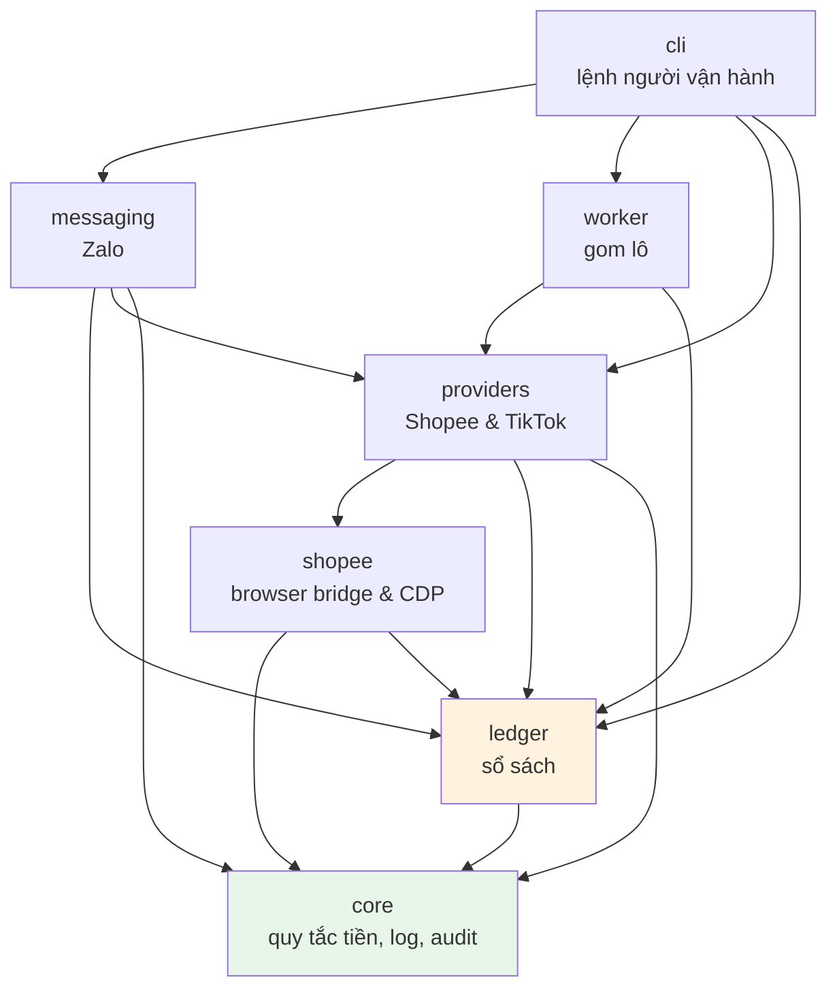

# Kiến trúc tổng thể

## Nguyên tắc phân tầng

Bảy package, xếp theo hướng phụ thuộc **một chiều**: tầng dưới không bao
giờ biết tầng trên.



`core` không import gì của dự án ngoài chính nó. Đó là lý do quy tắc tiền
kiểm chứng được mà không cần dựng database hay mở trình duyệt.

---

## Từng tầng làm gì

### `core` — quy tắc không phụ thuộc ai

| Module | Việc |
|---|---|
| `config.py` | Đọc `.env`, tính `PROJECT_ROOT`, mức hoàn tiền công bố |
| `policy.py` | **Toán tiền**: phí dịch vụ, thuế, trần 40.000₫, chia tiền |
| `identifiers.py` | Sinh `customer_id` / `request_id`, chặn ký tự sai |
| `logging_setup.py` | Log ứng dụng, xoay vòng theo dung lượng, nén gzip |
| `audit.py` | Dấu vết hành vi khách, JSONL, cắt theo tháng |

### `ledger` — sổ

| Module | Việc |
|---|---|
| `repository.py` | Lược đồ, migration, mọi thao tác ghi, ba quy tắc tiền |
| `metrics.py` | Ba chỉ số: tỷ lệ hoa hồng thực, tỷ lệ hợp lệ, AOV duyệt |
| `suspicion.py` | Năm dấu hiệu tài khoản đáng soi |

### `shopee` — mọi thứ chạm Shopee

| Module | Việc |
|---|---|
| `browser_bridge.py` | HTTP loopback nối với extension, xác thực bằng token |
| `page_selectors.py` | Selector đã dò được, kèm hai ràng buộc không đoán nổi |
| `link_generator.py` | Điều khiển trang Custom Link |
| `page_prober.py` | Dò lại cấu trúc trang khi selector hỏng |
| `commission.py` | **Một cửa vào**, hai nguồn phía sau, áp trần một chỗ |
| `dashboard_lookup.py` | Dữ liệu của chính Shopee — **nguồn ưu tiên** |
| `third_party_lookup.py` | Dự phòng khi dashboard không trả lời |
| `report_importer.py` | Đọc CSV báo cáo chuyển đổi, đoán cột |
| `reconciliation.py` | Khớp `sub_id` ngược về khách |

### `providers` — tích hợp đa sàn thương mại điện tử

| Module | Việc |
|---|---|
| `base.py` | `AffiliateProvider` interface, dataclass `LinkResult`, `CommissionInfo`, `OrderRecord` |
| `shopee_provider.py` | Provider cho sàn Shopee (nối `worker`, `shopee.commission`, `browser_bridge`) |
| `tiktok_provider.py` | Provider cho TikTok Shop qua AccessTrade Publisher API (tạo link v2, parse hoa hồng) |
| `accesstrade_reconciler.py` | Đồng bộ đơn hàng AccessTrade TikTok Shop (`order-list`), khớp `sub1` về khách |

### `messaging` — nói chuyện với khách

| Module | Việc |
|---|---|
| `zalo_client.py` | Bot API, long-poll, cắt tin dài 2000 ký tự |
| `conversation.py` | Tin nhắn này nghĩa là gì, trả lời ra sao |
| `templates.py` | Đọc `resources/messages.vi.json` |

### `worker` — chạy nền

| Module | Việc |
|---|---|
| `batch_queue.py` | Cửa sổ gom lô, lease chống kẹt |
| `runner.py` | Vòng lặp: gom → trình duyệt → ghi sổ |

---

## Ranh giới quan trọng nhất

**`core/policy.py` là nơi duy nhất biết toán tiền.**

Không có tỷ lệ hoa hồng nào hardcode ở bất cứ đâu khác. Chỉ số thực tế
đều đọc ngược ra từ dữ liệu thật trong `ledger/metrics.py`.

Nghĩa là muốn kiểm chứng phần tiền thì chỉ cần đọc một file 154 dòng,
không cần hiểu Zalo hay Shopee.

---

## Hai luồng chạy song song, không chặn nhau

`cashback serve` dựng hai vòng lặp trên hai luồng:

```
┌─────────────────────┐        ┌──────────────────────┐
│  vòng Zalo          │        │  vòng tạo link       │
│  long-poll 20s      │        │  gom lô 150s         │
│  chỉ chạm SỔ        │        │  chỉ chạm TRÌNH DUYỆT│
└─────────────────────┘        └──────────────────────┘
            └────────── SQLite ─────────┘
```

Tách ra vì **trình duyệt chậm**. Một lượt tạo link mất 5–10 giây; nếu chung
một luồng thì suốt thời gian đó bot không trả lời ai. Giờ khách nhắn gì
cũng được đáp ngay, còn link thì tới sau.

---

## Vì sao là SQLite

Một người vận hành, một máy, vài chục đơn mỗi ngày. SQLite cho:

- **Không cần server** — không có thứ gì để quên bật
- **Một file** — sao lưu là copy, khôi phục là dán
- **Giao dịch thật** — đủ để không trả tiền hai lần

Đổi sang Postgres chỉ có lý khi có nhiều người vận hành cùng lúc. Chưa tới
lúc đó.
