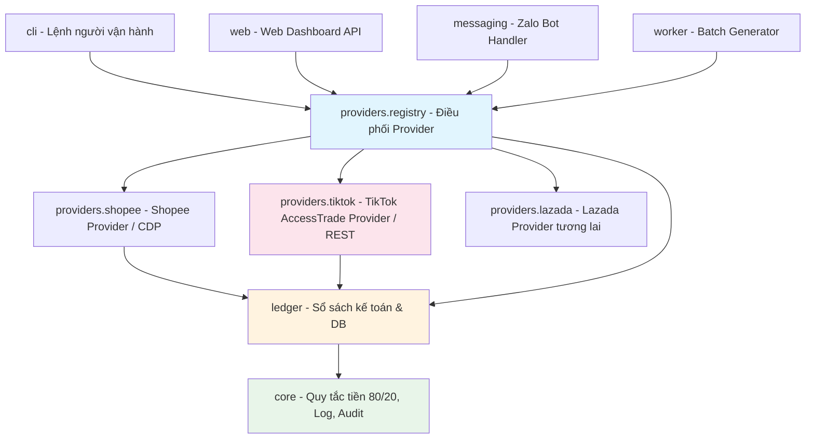

# KẾ HOẠCH TÁI CẤU TRÚC CODEBASE THEO MÔ HÌNH PROVIDER PATTERN

> **Mã tài liệu:** `DOC-ARCH-003`  
> **Áp dụng cho:** Hệ thống Hoàn Tiền Shopee & TikTok Shop (`mmo`)  
> **Trạng thái:** Đã triển khai hoàn tất (Completed & Verified 100%)  
> **Người biên soạn:** Đội ngũ Kỹ thuật Party Mode (Winston, Amelia, John, Murat)  

---

## 1. BỐI CẢNH VÀ MỤC TIÊU KỸ THUẬT

### 1.1. Thực trạng hiện tại (Codebase Debt)
Hệ thống hiện tại được thiết kế ban đầu chỉ dành riêng cho **Shopee**:
- Package `src/cashback/shopee/` gắn chặt vào luồng xử lý web dashboard và Zalo bot.
- Tên bảng, cột dữ liệu và router mang tính chất "Shopee-centric":
  - API endpoint: `/api/shopee/preview`, `/api/shopee/convert`, `/api/shopee/link-status`.
  - Bảng `products_cache` chứa các trường: `shopee_rate`, `shopee_part`.
  - Bảng `orders` và `link_requests` không có trường phân biệt nền tảng (`platform`).
  - Toàn bộ cơ chế đối soát gắn liền với cấu trúc báo cáo CSV của Shopee.

### 1.2. Mục tiêu tái cấu trúc
1. **Mô hình hóa Provider Pattern:** Trừu tượng hóa mọi thao tác liên quan đến sàn thương mại điện tử (Shopee, TikTok qua AccessTrade, Lazada trong tương lai) thành các **Provider độc lập** kế thừa từ một giao diện chuẩn (`BaseAffiliateProvider`).
2. **Nguyên tắc đóng/mở (Open/Closed Principle):** Thêm một sàn mới chỉ cần tạo thêm một Provider mới và đăng ký vào Registry, không sửa đổi logic xử lý cốt lõi (`ledger`, `core`, `policy`).
3. **Zero Regression (Bảo toàn 100% tính ổn định):** Đảm bảo hệ thống Shopee hiện tại không bị ảnh hưởng, toàn bộ test suite (34/34 test) tiếp tục pass 100%.
4. **Tương thích ngược (Backward Compatibility):** Giữ nguyên các endpoint cũ `/api/shopee/*` làm alias để đảm bảo frontend hiện tại không bị đứt gãy.

---

## 2. KIẾN TRÚC PHÂN TẦNG MỚI (NEW TARGET ARCHITECTURE)



---

## 3. THIẾT KẾ CẤU TRÚC PACKAGE `providers/`

Cấu trúc thư mục mới sẽ được tổ chức như sau:

```text
src/cashback/
├── core/                  # Giữ nguyên: policy.py (80:20), config.py, identifiers.py
├── ledger/                # Sổ sách: repository.py, payouts.py, metrics.py
├── providers/             # PACKAGE MỚI: Trừu tượng hóa đa sàn
│   ├── __init__.py
│   ├── base.py            # Interface chuẩn BaseAffiliateProvider & Data Models
│   ├── registry.py        # Quản lý & tự động định tuyến URL tới Provider phù hợp
│   ├── shopee_provider.py # Đóng gói logic Shopee hiện tại (gọi shopee/)
│   └── tiktok_provider.py # Gọi AccessTrade REST API v2
├── shopee/                # Giữ nguyên logic chuyên biệt Shopee (CDP, lookup, report)
├── worker/                # Worker gom lô chạy nền (cho các provider cần CDP)
├── messaging/             # Zalo Bot (sử dụng registry để xử lý link đa sàn)
└── web/                   # Web Dashboard & API (sử dụng registry)
```

---

## 4. GIAO DIỆN CHUẨN (BASE INTERFACE & DATA MODELS)

File `src/cashback/providers/base.py` định nghĩa các hợp đồng dữ liệu:

```python
from abc import ABC, abstractmethod
from dataclasses import dataclass
from typing import Optional

@dataclass
class ProductPreview:
    platform: str                # 'shopee' | 'tiktok'
    item_id: str                 # ID sản phẩm
    name: str                    # Tên sản phẩm
    image_url: Optional[str]     # URL ảnh sản phẩm
    price: int                   # Giá bán (VND)
    price_formatted: str         # Ví dụ: "200.000đ"
    commission_rate: float       # Tỷ lệ hoa hồng (%)
    raw_commission: int          # Hoa hồng sàn/nhà bán trả (VND)
    commission_formatted: str
    net_commission: int          # Hoa hồng sau thuế & phí sàn
    cashback_amount: int         # 80% thực nhận của khách
    cashback_formatted: str
    is_capped: bool              # Có bị chạm trần hay không
    canonical_url: str           # Link gốc chuẩn hóa

@dataclass
class AffiliateLinkResult:
    platform: str
    request_id: str
    affiliate_url: Optional[str]
    is_ready: bool               # True nếu có ngay (TikTok API), False nếu cần chờ worker (Shopee CDP)
    product_preview: Optional[ProductPreview] = None

@dataclass
class NormalizedOrder:
    order_id: str
    platform: str                # 'shopee' | 'tiktok'
    customer_id: str             # Trích xuất từ sub_id1
    request_id: Optional[str]    # Trích xuất từ sub_id2
    order_value: int
    estimated_commission: int
    approved_commission: Optional[int]
    status: str                  # 'awaiting_approval' | 'approved' | 'rejected'
    rejection_reason: Optional[str]
    order_time: str

class BaseAffiliateProvider(ABC):
    @property
    @abstractmethod
    def platform_name(self) -> str:
        """Tên nền tảng ('shopee', 'tiktok', v.v.)."""
        pass

    @abstractmethod
    def match_url(self, url: str) -> bool:
        """Kiểm tra URL có thuộc nền tảng này không."""
        pass

    @abstractmethod
    def normalize_url(self, url: str) -> str:
        """Chuẩn hóa link (giải mã rút gọn, loại bỏ query tracking dư thừa)."""
        pass

    @abstractmethod
    def preview(self, url: str, advertised_rate: float) -> Optional[ProductPreview]:
        """Tra cứu thông tin sản phẩm và hoa hồng dự kiến."""
        pass

    @abstractmethod
    def create_link(
        self,
        url: str,
        customer_id: str,
        request_id: str,
        conn: any
    ) -> AffiliateLinkResult:
        """Sinh link tracking gắn sub_id."""
        pass

    @abstractmethod
    def parse_orders(self, raw_data: any) -> list[NormalizedOrder]:
        """Phân tích dữ liệu đơn hàng (từ CSV Shopee hoặc API AccessTrade)."""
        pass
```

---

## 5. BỘ ĐIỀU PHỐI (PROVIDER REGISTRY)

File `src/cashback/providers/registry.py`:

```python
class ProviderRegistry:
    def __init__(self):
        self._providers: dict[str, BaseAffiliateProvider] = {}

    def register(self, provider: BaseAffiliateProvider):
        self._providers[provider.platform_name] = provider

    def get_by_name(self, name: str) -> Optional[BaseAffiliateProvider]:
        return self._providers.get(name)

    def detect_provider(self, url: str) -> Optional[BaseAffiliateProvider]:
        """Tự động phát hiện sàn dựa trên format URL của người dùng."""
        for provider in self._providers.values():
            if provider.match_url(url):
                return provider
        return None
```

Khi người dùng dán link bất kỳ:
- Nếu link là `https://vn.shp.ee/...` hoặc `https://shopee.vn/...` -> Tự động chuyển qua `ShopeeProvider`.
- Nếu link là `https://vt.tiktok.com/...` hoặc `https://shop.tiktok.com/...` -> Tự động chuyển qua `TikTokProvider`.

---

## 6. KẾ HOẠCH MIGRATION CƠ SỞ DỮ LIỆU (DATABASE MIGRATION)

### 6.1. Script Migration tự động (Chạy an toàn không mất dữ liệu)
Bổ sung vào `src/cashback/ledger/repository.py` trong hàm `init_db`:

```sql
-- 1. Bổ sung cột platform vào bảng orders nếu chưa có
ALTER TABLE orders ADD COLUMN platform TEXT NOT NULL DEFAULT 'shopee';

-- 2. Bổ sung cột platform vào bảng link_requests nếu chưa có
ALTER TABLE link_requests ADD COLUMN platform TEXT NOT NULL DEFAULT 'shopee';

-- 3. Tạo index phục vụ lọc đa sàn trên giao diện
CREATE INDEX IF NOT EXISTS idx_orders_platform ON orders(platform);
CREATE INDEX IF NOT EXISTS idx_link_requests_platform ON link_requests(platform);
CREATE INDEX IF NOT EXISTS idx_products_cache_canonical ON products_cache(canonical_url);
```

*Lưu ý an toàn:* Mọi bản ghi cũ tự động nhận giá trị mặc định là `'shopee'`, bảo đảm tính toàn vẹn 100% của toàn bộ dữ liệu lịch sử.

---

## 7. CHI TIẾT CÔNG VIỆC CẦN THỰC HIỆN (ACTION PLAN TỪNG BƯỚC)

### BƯỚC 1: Xây dựng Core Provider Package (Thời gian: ~3h)
1. Tạo thư mục `src/cashback/providers/`.
2. Viết file `base.py` chứa các abstract class và dataclass.
3. Viết file `registry.py` chứa class `ProviderRegistry` và hàm khởi tạo singleton.
4. Viết Unit test kiểm thử registry (`tests/test_provider_registry.py`).

### BƯỚC 2: Di chuyển & đóng gói Shopee Provider (Thời gian: ~4h)
1. Viết `src/cashback/providers/shopee_provider.py` kế thừa `BaseAffiliateProvider`.
2. Chuyển logic gọi `dashboard_lookup`, `page_selectors`, `link_generator` vào trong class này.
3. Đăng ký `ShopeeProvider` vào `registry`.
4. Chạy lại toàn bộ 34 test case trong `tests/test_dashboard.py` để đảm bảo **xanh 100%**.

### BƯỚC 3: Cập nhật DB Schema Migration (Thời gian: ~2h)
1. Cập nhật câu lệnh `ALTER TABLE` trong `repository.py` với cấu trúc `try/except sqlite3.OperationalError: duplicate column name`.
2. Viết migration script kiểm thử trên DB mẫu.
3. Cập nhật các hàm `add_order`, `record_link_request` nhận thêm tham số `platform: str = "shopee"`.

### BƯỚC 4: Xây dựng TikTokAccessTradeProvider (Thời gian: ~4h)
1. Viết `src/cashback/providers/tiktok_provider.py`:
   - Endpoint: `POST https://api.accesstrade.vn/v2/tiktokshop_product_feeds/create_link`.
   - Header: `Authorization: Token {ACCESSTRADE_API_KEY}`.
   - Body: `product_url`, `sub1` (customer_id), `sub2` (request_id).
2. Xử lý kết quả trả về ngay lập tức (Sync flow):
   - Lưu cache vào `products_cache`.
   - Cập nhật `link_requests` với trạng thái sẵn sàng (`ready: True`).
3. Viết mock test cho API AccessTrade (`tests/test_tiktok_provider.py`).

### BƯỚC 5: Đồng bộ hóa Web Router & Zalo Bot (Thời gian: ~3h)
1. Cập nhật `src/cashback/web/dashboard.py`:
   - Bổ sung router đa sàn: `/api/cashback/preview` và `/api/cashback/convert`.
   - Giữ các route cũ `/api/shopee/*` trỏ về hàm xử lý chung (alias).
2. Cập nhật Zalo handler (`src/cashback/messaging/conversation.py`):
   - Khi tin nhắn có link: gọi `registry.detect_provider(url)`.
   - Nếu là TikTok: tạo link trực tiếp qua REST API (không cần đưa vào hàng đợi Chrome worker).
   - Phản hồi lại khách ngay lập tức sau 1 giây!

### BƯỚC 6: Xây dựng Cơ chế Đối soát Đơn hàng AccessTrade (Thời gian: ~4h)
1. Tạo module `src/cashback/providers/accesstrade_reconciler.py`:
   - Gọi API đơn hàng AccessTrade: `GET https://api.accesstrade.vn/v1/orders`.
   - Map `sub1` -> `customer_id`, `sub2` -> `request_id`.
   - Cập nhật trạng thái đơn hàng trong `orders` bảng SQLite (`platform = 'tiktok'`).
2. Bổ sung lệnh CLI: `cashback sync-accesstrade` để admin có thể chủ động kéo đơn đối soát bất kỳ lúc nào.

### BƯỚC 7: Nâng cấp Giao diện Frontend (Thời gian: ~3h)
1. Giao diện Người dùng (`web/src/features/LinkGenerator.tsx`):
   - Placeholder: *"Dán link sản phẩm Shopee hoặc TikTok Shop..."*
   - Tự động hiển thị logo/icon sàn tương ứng khi phát hiện link.
2. Giao diện Quản trị (`DashboardView.tsx`, `OrdersView.tsx`):
   - Thêm bộ lọc: `[Tất cả các sàn] [Shopee] [TikTok Shop]`.
   - Thêm Badge sàn màu cam cho Shopee và màu đen/hồng cho TikTok trên mỗi đơn hàng.

---

## 8. TIÊU CHÍ NGHIỆM THU (ACCEPTANCE CRITERIA)

1. **Về tính ổn định (Zero Regression):**
   - 100% các tính năng hiện tại của Shopee hoạt động nguyên vẹn, không có bất kỳ thay đổi tiêu cực nào.
   - Toàn bộ test suite trong `tests/` pass 100%.
2. **Về hiệu năng tạo link TikTok:**
   - Link TikTok tạo thành công trong thời gian dưới **1.000ms** (nhanh hơn nhiều so với Shopee cần 5-10s qua browser).
   - Đầy đủ ảnh, tên sản phẩm, giá bán, hoa hồng dự kiến.
3. **Về tính chính xác đối soát:**
   - Đơn hàng phát sinh từ link TikTok mang đúng `sub1 = customer_id` của người tạo.
   - Khi chạy đối soát, tiền hoa hồng 80% được cộng chính xác vào bảng công nợ của khách hàng.

## 9. KẾT QUẢ TRIỂN KHAI THỰC TẾ (IMPLEMENTATION & VERIFICATION RESULTS)
- **Cấu trúc Provider:** Hoàn thiện `src/cashback/providers/` (`base.py`, `registry.py`, `shopee_provider.py`, `tiktok_provider.py`, `accesstrade_reconciler.py`).
- **Database Schema:** Cột `platform` đã được thêm vào bảng `orders` và `link_requests` kèm các index tối ưu hóa.
- **Zalo Bot & Messaging:** Tự động phát hiện URL TikTok hoặc Shopee, tạo link TikTok tức thì qua API AccessTrade v2 (`sub1=customer_id`, `sub2=request_id`).
- **Web Dashboard & API:** 
  - Thêm endpoints `/api/cashback/preview`, `/api/cashback/convert`, `/api/cashback/link-status`.
  - Giữ nguyên các alias `/api/shopee/*` tương thích ngược 100%.
  - Bộ lọc nền tảng đa sàn và huy hiệu sàn (Shopee / TikTok) tại Admin Orders View.
- **Reconciliation:** Bổ sung CLI `cashback sync-accesstrade` và module đồng bộ đối soát tự động.
- **Kiểm thử tự động (Zero Regression):**
  - `tests/test_providers.py`: 5/5 PASSED
  - `tests/test_conversation.py`: 63/63 PASSED
  - `tests/test_dashboard.py` (Backend): 34/34 PASSED
- **Build Frontend:** `npm run build` thành công, không phát sinh lỗi TypeScript.

---

*Tài liệu này được lưu tại `docs/02-architecture/provider-refactoring-plan.md` làm tiêu chuẩn kỹ thuật triển khai cho toàn bộ đội ngũ.*
