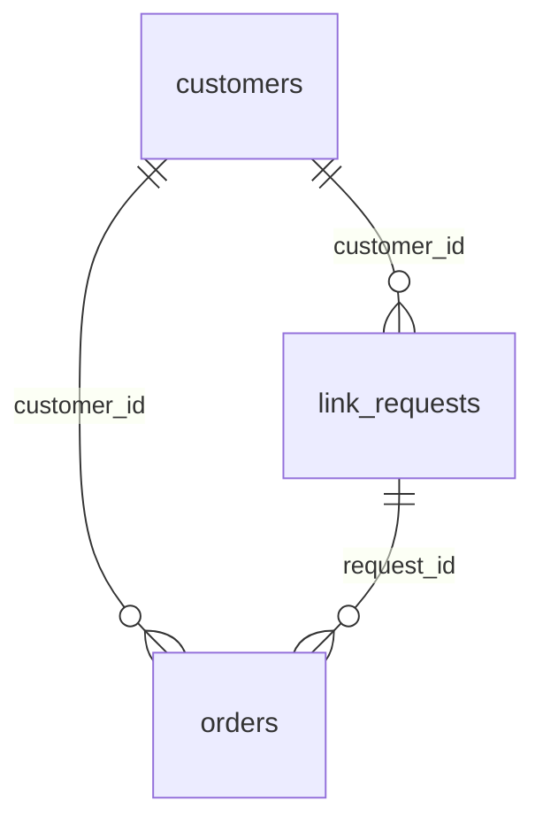

# Lược đồ cơ sở dữ liệu

> Sinh từ DDL trong `ledger/repository.py`.



## `customers`

| Cột | Kiểu | Ghi chú |
|---|---|---|
| `customer_id` | TEXT | khoá chính |
| `zalo_user_id` | TEXT |  |
| `private_chat_id` | TEXT |  |
| `display_name` | TEXT |  |
| `bank_name` | TEXT |  |
| `bank_account` | TEXT |  |
| `account_holder` | TEXT |  |
| `consent_at` | TEXT |  |
| `status` | TEXT | bắt buộc |
| `created_at` | TEXT | bắt buộc |

## `link_requests`

| Cột | Kiểu | Ghi chú |
|---|---|---|
| `request_id` | TEXT | khoá chính |
| `customer_id` | TEXT | → customers, bắt buộc |
| `created_at` | TEXT | bắt buộc |
| `source_url` | TEXT | bắt buộc |
| `affiliate_url` | TEXT |  |
| `estimated_commission` | INTEGER |  |
| `channel` | TEXT |  |
| `status` | TEXT | bắt buộc |
| `platform` | TEXT | bắt buộc, mặc định 'shopee' (shopee / tiktok) |
| `notified_at` | TEXT |  |

## `orders`

| Cột | Kiểu | Ghi chú |
|---|---|---|
| `order_id` | TEXT | khoá chính |
| `customer_id` | TEXT | → customers |
| `request_id` | TEXT | → link_requests |
| `order_value` | INTEGER |  |
| `estimated_commission` | INTEGER |  |
| `approved_commission` | INTEGER |  |
| `cashback_amount` | INTEGER |  |
| `status` | TEXT | bắt buộc |
| `platform` | TEXT | bắt buộc, mặc định 'shopee' (shopee / tiktok) |
| `rejection_reason` | TEXT |  |
| `recorded_at` | TEXT |  |
| `approved_at` | TEXT |  |
| `paid_at` | TEXT |  |
| `updated_at` | TEXT | bắt buộc |

## `state_history`

| Cột | Kiểu | Ghi chú |
|---|---|---|
| `id` | INTEGER | khoá chính |
| `order_id` | TEXT | bắt buộc |
| `from_status` | TEXT |  |
| `to_status` | TEXT | bắt buộc |
| `changed_at` | TEXT | bắt buộc |
| `note` | TEXT |  |

## `manual_review`

| Cột | Kiểu | Ghi chú |
|---|---|---|
| `id` | INTEGER | khoá chính |
| `order_id` | TEXT |  |
| `raw_data` | TEXT | bắt buộc |
| `reason` | TEXT | bắt buộc |
| `created_at` | TEXT | bắt buộc |
| `resolved` | INTEGER | bắt buộc |

## `reconciliation_runs`

| Cột | Kiểu | Ghi chú |
|---|---|---|
| `id` | INTEGER | khoá chính |
| `ran_at` | TEXT | bắt buộc |
| `source` | TEXT | bắt buộc |
| `period_start` | TEXT |  |
| `period_end` | TEXT |  |
| `rows_read` | INTEGER | bắt buộc |
| `orders_new` | INTEGER | bắt buộc |
| `approved` | INTEGER | bắt buộc |
| `rejected` | INTEGER | bắt buộc |
| `skipped` | INTEGER | bắt buộc |
| `needs_review` | INTEGER | bắt buộc |
| `error` | TEXT |  |

## Cột thêm sau

Thêm bằng cách khai ở `_LATER_COLUMNS`, **đừng sửa DDL** — `serve` tự chạy migration khi khởi động.

```python
_LATER_COLUMNS = {
    "link_requests": {
        "notified_at": "TEXT",
        "estimate_source": "TEXT",
        "estimate_detail": "TEXT",
        # How many times the browser has tried this one. A link that
        # cannot be made was retried forever and the customer was never
        # told; after MAX_LINK_ATTEMPTS it is given up on and they hear
        # about it.
        "attempts": "INTEGER NOT NULL DEFAULT 0",
    },
    # The last status the customer was actually told about. Compared with
    # `status` to find who is owed an update, which makes the notifier safe
    # to run repeatedly and safe across a restart.
    "orders": {"notified_status": "TEXT"},
}
```

