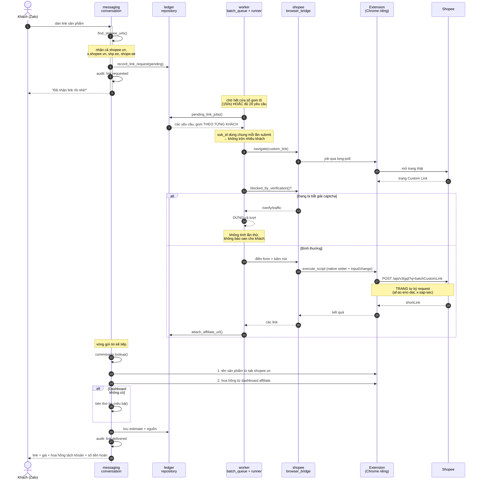

# Sequence — từ lúc khách gửi link tới lúc nhận link

Đây là luồng chạy nhiều nhất. Đọc kỹ cái này là hiểu được 80% hệ thống.



---

## Vì sao lại gom lô 150 giây

Ba lý do, theo thứ tự quan trọng:

1. **Giảm dấu chân.** Năm khách gửi link trong một phút → **một** lần mở
   trang, không phải năm. Đây là thứ giữ tài khoản an toàn.
2. **Trang Custom Link nhận tối đa 5 link mỗi lần submit.** Gom lại thì
   tận dụng được.
3. Mở trang mất vài giây; làm một lượt rẻ hơn nhiều lượt.

Đổi ở `.env`:

```
BATCH_WINDOW_SECONDS=150
BATCH_MAX_SIZE=20
```

---

## Chỗ dễ hiểu nhầm nhất

**Bot không gọi API Shopee.** Nó bảo trình duyệt bấm nút, rồi **trang tự
gửi request của nó** — kèm chữ ký thiết bị mà chỉ SDK của Shopee sinh ra
được.

Gọi thẳng API đó bằng cookie sẽ **bị chặn**, và thử vài lần là **cả phiên
bị bắt giải captcha**. Đã kiểm chứng, xem
[`../04-reference/shopee-api-findings.md`](../04-reference/shopee-api-findings.md).
