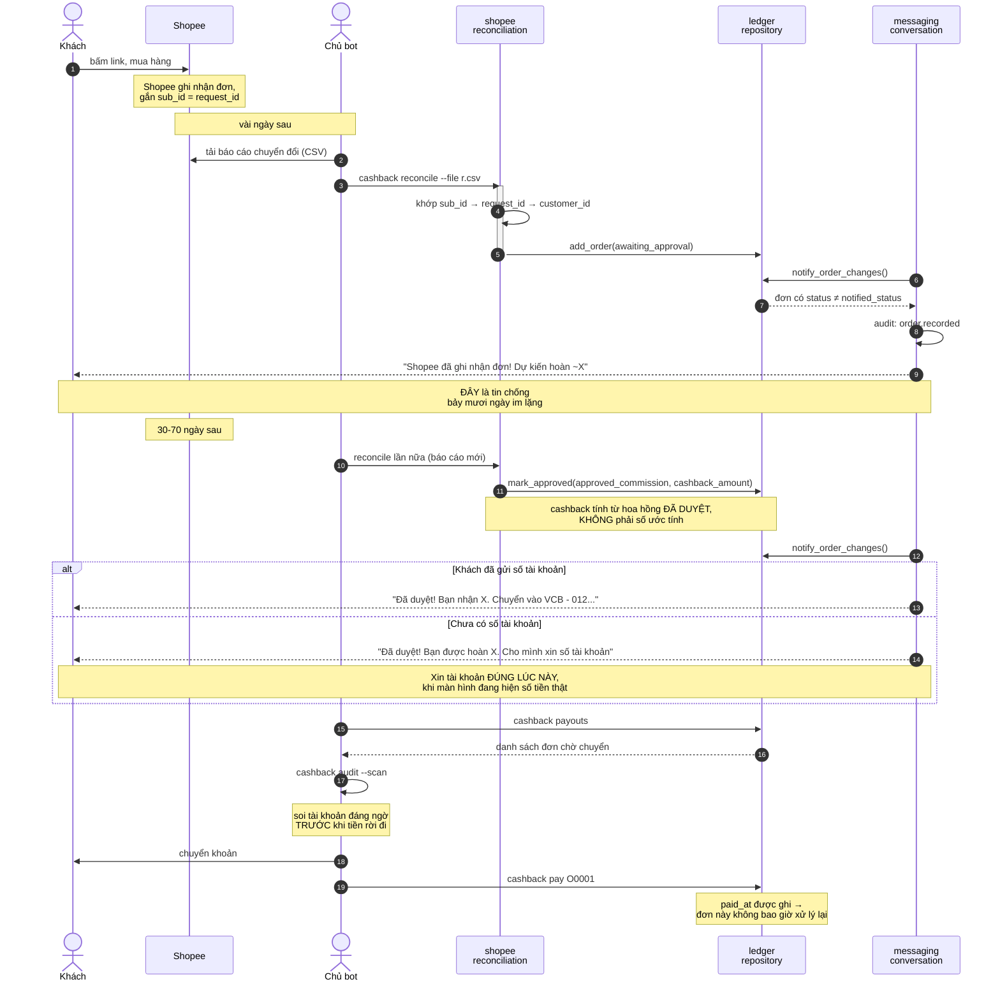
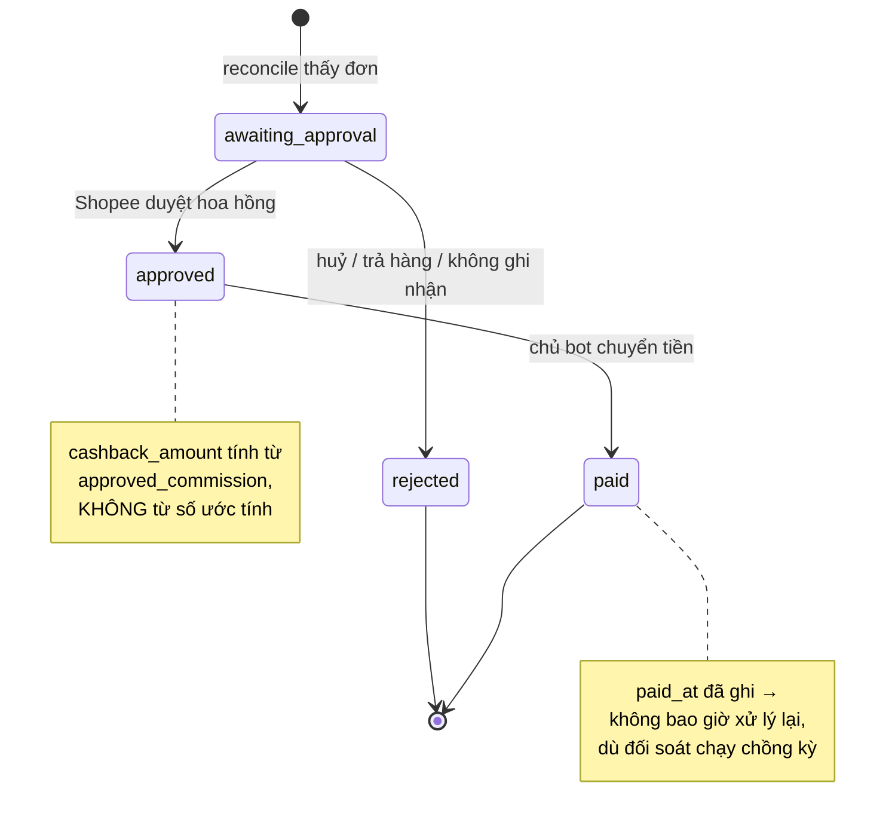
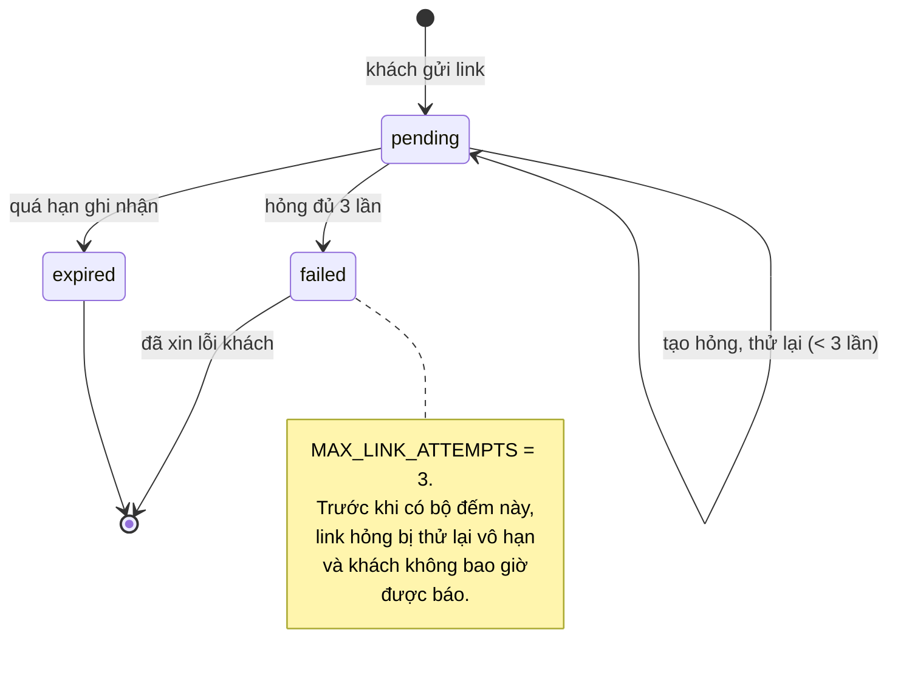

# Sequence — từ lúc khách mua tới lúc nhận tiền

Đoạn này kéo dài **30–70 ngày**. Chỗ dễ mất khách nhất không phải kỹ thuật
mà là **im lặng**: nếu suốt hai tháng bot không nói gì, khách kết luận là
bị lừa.

---

## Vì sao xin số tài khoản muộn như vậy

Bản đầu xin ngay ở tin nhắn chào. Ba người dùng thật đọc thử và đều dừng ở
cùng một chỗ:

> *"Tôi mới gõ mỗi chữ 'hi'. Chưa mua gì. Chưa có đồng nào. Mà nó đã đòi số
> tài khoản."*
>
> *"Xin tài khoản để trả một khoản chưa tồn tại — tự nghe lại câu đó đi."*

Người lạ + tin nhắn đầu + xin số tài khoản = đúng kịch bản lừa đảo.

Nên bot **không bao giờ tự hỏi trước**. Nó hỏi đúng lúc màn hình đang hiện
*"Bạn được hoàn 6.484đ"* — lúc đó khách đưa ngay. Muốn chủ động gửi thì gõ
`/nganhang`.

---

## Máy trạng thái đơn hàng

Mọi lần chuyển trạng thái đều ghi vào `state_history` — **chỉ thêm, không
bao giờ ghi đè**. Đó là thứ dùng để trả lời *"đơn này đã đi qua những đâu"*
khi có tranh cãi.

---

## Máy trạng thái yêu cầu link

