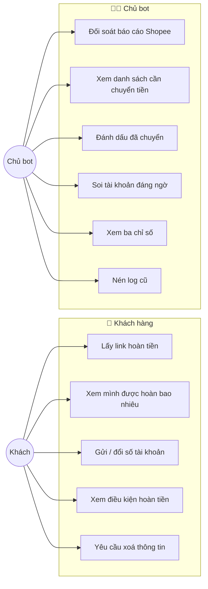

# Use case — ai làm gì với hệ thống

## Hai nhóm người dùng



---

## UC1 — Lấy link hoàn tiền *(quan trọng nhất)*

| | |
|---|---|
| **Ai** | Khách hàng |
| **Điều kiện trước** | Đã nhắn riêng với bot ít nhất một lần |
| **Kết quả** | Khách nhận link tiếp thị liên kết riêng của mình |

**Luồng chính**

1. Khách dán link sản phẩm Shopee vào chat riêng với bot
2. Bot nhận ra đó là link Shopee, ghi vào sổ, trả lời *"đã nhận"*
3. Yêu cầu nằm trong hàng đợi cho tới khi hết cửa sổ gom lô (mặc định 150 giây)
4. Worker mở trang Custom Link, điền tối đa 5 link của **cùng một khách**
5. Bot tra hoa hồng: dashboard Shopee trước, bên thứ ba sau
6. Bot gửi riêng cho khách: link + giá + hoa hồng tách khoản + số tiền hoàn

**Luồng phụ**

| Tình huống | Bot làm gì |
|---|---|
| Tin nhắn kèm khung ảnh xem trước | Zalo bóc mất link → bot hướng dẫn bấm ✕ rồi gửi lại |
| Không tra được hoa hồng | Vẫn gửi link, **không hiện số** thay vì đoán bừa |
| Sản phẩm chạm trần 40.000₫ | Gửi kèm một câu giải thích *"không phải mình giữ lại"* |
| Tạo link hỏng 3 lần | Đánh dấu `failed`, gửi lời xin lỗi |
| Shopee bắt giải captcha | **Dừng cả lượt**, không tính lần thử, không báo oan cho khách |

---

## UC6 — Đối soát báo cáo Shopee

| | |
|---|---|
| **Ai** | Chủ bot |
| **Điều kiện trước** | Đã tải báo cáo chuyển đổi từ dashboard |
| **Kết quả** | Đơn vào sổ, khách được báo tin |

1. Chủ bot tải CSV từ `affiliate.shopee.vn/report/conversion_report`
2. Chạy `cashback inspect-report --file r.csv` để kiểm cột
3. Chạy `cashback reconcile --file r.csv`
4. Hệ thống khớp `sub_id` ngược về `request_id` → biết đơn của ai
5. Đơn vào sổ ở trạng thái tương ứng
6. Lần chạy tiếp theo của `serve` sẽ **tự nhắn khách**

**Điều kiện bất biến:** đơn đã có `paid_at` **không bao giờ** bị xử lý lại,
dù báo cáo có chồng kỳ bao nhiêu lần.

---

## UC9 — Soi tài khoản đáng ngờ

| | |
|---|---|
| **Ai** | Chủ bot |
| **Khi nào** | Trước mỗi đợt chuyển tiền |

```bash
cashback audit --scan
```

Năm dấu hiệu, xếp theo mức nghiêm trọng:

| Dấu hiệu | Mức | Nghĩa là |
|---|---|---|
| `shared_bank_account` | 🔴 Cao | Nhiều khách cùng một số tài khoản nhận tiền |
| `frequent_bank_change` | 🟡 Vừa | Đổi tài khoản nhận tiền ≥ 3 lần |
| `mostly_rejected` | 🟡 Vừa | Trên 50% đơn bị Shopee từ chối |
| `sudden_volume` | 🟡 Vừa | ≥ 20 yêu cầu link trong một ngày |
| `never_buys` | 🔵 Thấp | ≥ 8 link, chưa đơn nào |

**Không cái nào là bằng chứng.** Chúng là *hình dạng* đáng nhìn kỹ. Mỗi
phát hiện đều kèm bằng chứng sinh ra nó, để người quyết định chứ không phải
máy quyết định.

Muốn xem lịch sử đầy đủ một người:

```bash
cashback audit --customer C0001
```
