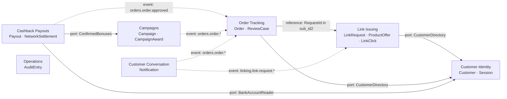

# Context Map

```mermaid
flowchart LR
    identity["Customer Identity<br/>Customer · Session"]
    linking["Link Issuing<br/>LinkRequest · ProductOffer · LinkClick"]
    orders["Order Tracking<br/>Order · ReviewCase"]
    payouts["Cashback Payouts<br/>Payout · NetworkSettlement"]
    campaigns["Campaigns<br/>Campaign · CampaignAward"]
    messaging["Customer Conversation<br/>Notification"]
    operations["Operations<br/>AuditEntry"]
    linking -->|port: CustomerDirectory| identity
    orders -->|port: CustomerDirectory| identity
    orders -->|reference: RequestId in sub_id2| linking
    payouts -.->|event: orders.order.approved| orders
    payouts -->|port: BankAccountReader| identity
    campaigns -.->|event: orders.order.*| orders
    payouts -->|port: ConfirmedBonuses| campaigns
    messaging -.->|event: orders.order.*| orders
    messaging -.->|event: linking.link-request.*| linking
```

Legend: `PORT` synchronous call, `EVENT` asynchronous fact, `REFERENCE` identifier link, `EXTERNAL` outside system.
