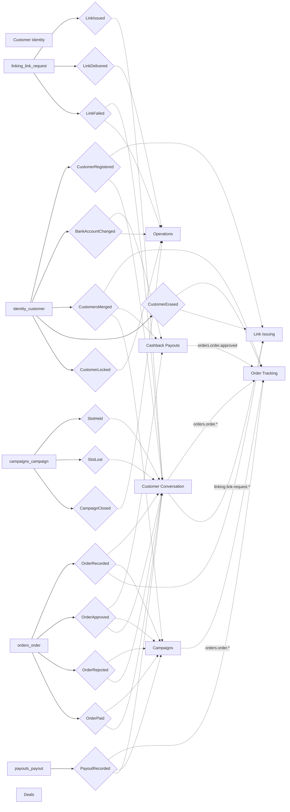

# Event Flow

```mermaid
flowchart LR
    identity["Customer Identity"]
    event_identity_customer_registered{"CustomerRegistered"}
    identity_customer --> event_identity_customer_registered
    event_identity_customer_registered -.-> linking
    event_identity_customer_registered -.-> messaging
    event_identity_customer_bank_account_changed{"BankAccountChanged"}
    identity_customer --> event_identity_customer_bank_account_changed
    event_identity_customer_bank_account_changed -.-> payouts
    event_identity_customer_bank_account_changed -.-> operations
    event_identity_customer_merged{"CustomersMerged"}
    identity_customer --> event_identity_customer_merged
    event_identity_customer_merged -.-> orders
    event_identity_customer_merged -.-> payouts
    event_identity_customer_merged -.-> campaigns
    event_identity_customer_erased{"CustomerErased"}
    identity_customer --> event_identity_customer_erased
    event_identity_customer_erased -.-> orders
    event_identity_customer_erased -.-> linking
    event_identity_customer_locked{"CustomerLocked"}
    identity_customer --> event_identity_customer_locked
    event_identity_customer_locked -.-> operations
    linking["Link Issuing"]
    event_linking_link_request_issued{"LinkIssued"}
    linking_link_request --> event_linking_link_request_issued
    event_linking_link_request_issued -.-> messaging
    event_linking_link_request_delivered{"LinkDelivered"}
    linking_link_request --> event_linking_link_request_delivered
    event_linking_link_request_delivered -.-> operations
    event_linking_link_request_failed{"LinkFailed"}
    linking_link_request --> event_linking_link_request_failed
    event_linking_link_request_failed -.-> messaging
    event_linking_link_request_failed -.-> operations
    orders["Order Tracking"]
    event_orders_order_recorded{"OrderRecorded"}
    orders_order --> event_orders_order_recorded
    event_orders_order_recorded -.-> messaging
    event_orders_order_recorded -.-> campaigns
    event_orders_order_recorded -.-> linking
    event_orders_order_approved{"OrderApproved"}
    orders_order --> event_orders_order_approved
    event_orders_order_approved -.-> payouts
    event_orders_order_approved -.-> campaigns
    event_orders_order_approved -.-> messaging
    event_orders_order_rejected{"OrderRejected"}
    orders_order --> event_orders_order_rejected
    event_orders_order_rejected -.-> campaigns
    event_orders_order_rejected -.-> messaging
    event_orders_order_paid{"OrderPaid"}
    orders_order --> event_orders_order_paid
    event_orders_order_paid -.-> campaigns
    event_orders_order_paid -.-> messaging
    payouts["Cashback Payouts"]
    event_payouts_payout_recorded{"PayoutRecorded"}
    payouts_payout --> event_payouts_payout_recorded
    event_payouts_payout_recorded -.-> orders
    event_payouts_payout_recorded -.-> campaigns
    event_payouts_payout_recorded -.-> messaging
    campaigns["Campaigns"]
    event_campaigns_award_held{"SlotHeld"}
    campaigns_campaign --> event_campaigns_award_held
    event_campaigns_award_held -.-> messaging
    event_campaigns_award_lost{"SlotLost"}
    campaigns_campaign --> event_campaigns_award_lost
    event_campaigns_award_lost -.-> messaging
    event_campaigns_campaign_closed{"CampaignClosed"}
    campaigns_campaign --> event_campaigns_campaign_closed
    event_campaigns_campaign_closed -.-> operations
    messaging["Customer Conversation"]
    catalog["Deals"]
    operations["Operations"]
    payouts -.->|orders.order.approved| orders
    campaigns -.->|orders.order.*| orders
    messaging -.->|orders.order.*| orders
    messaging -.->|linking.link-request.*| linking
```
